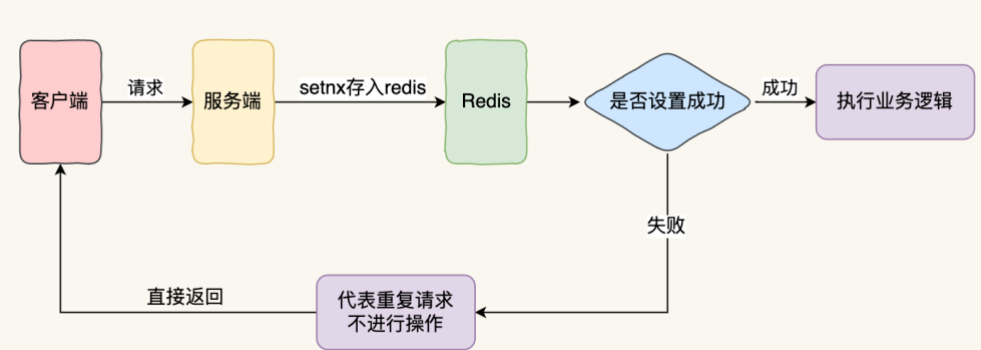
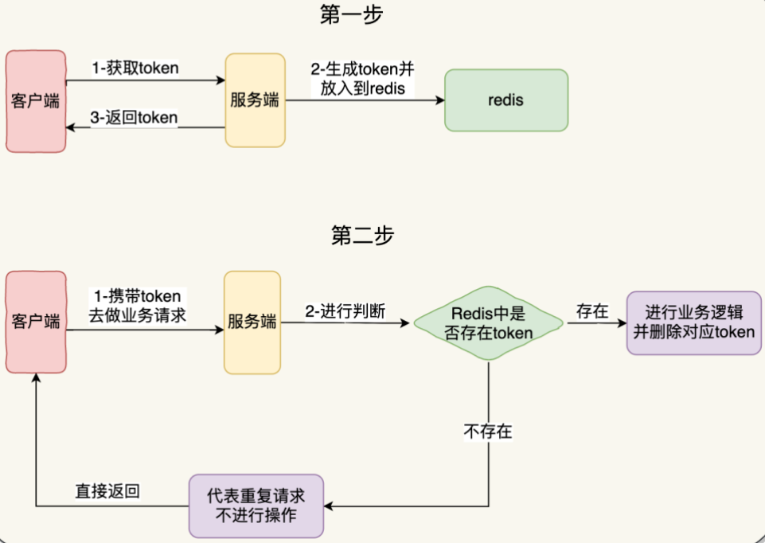

# Elegent Idem【幂等性框架】

## 介绍

这是一个基于springboot的优雅的幂等性框架。使用这个组件可以让你更轻松、更优雅地在项目中实现接口幂等性处理，让你更专注业务代码的开发。它目前支持令牌和序列号两种检查策略。用户只需要在方法上添加一个注解，即可实现接口幂等性。

### 序列号（sn）检查策略

通过序列号机制实现接口的幂等性，示意图如下：



具体流程步骤：

1. 客户端先请求服务端，会拿到一个能代表这次请求业务的唯一字段
2. 将该字段以 SETNX 的方式存入 redis 中，并根据业务设置相应的超时时间
3. 如果设置成功，证明这是第一次请求，则执行后续的业务逻辑
4. 如果设置失败，则代表已经执行过当前请求，直接返回

### 令牌（token）检查策略

通过token 机制实现接口的幂等性，示意图如下：



具体流程步骤：

1.客户端会先发送一个请求去获取 token，服务端会生成一个全局唯一的 ID 作为 token 保存在 redis 中，同时把这个 ID 返回给客户端

2.客户端第二次调用业务请求的时候必须携带这个 token

3.服务端会校验这个 token，如果校验成功，则执行业务，并删除 redis 中的 token

4.如果校验失败，说明 redis 中已经没有对应的 token，则表示重复操作，直接返回指定的结果给客户端

## 使用说明

### 准备工作

1.在项目中引入依赖

```xml
<dependency>
    <groupId>cn.elegent.idem</groupId>
    <artifactId>elegent-idem-core</artifactId>
    <version>1.0.0</version>
</dependency>
```
2.在项目配置文件添加配置。  如果是本地redis，可缺省

```yaml
elegent:
  data:
    type: redis
    redis:
      nodes: 127.0.0.1:6379
```

 配置说明：

  （1）data.type ：指定数据中心的类型。默认值为redis。

  （2）data.redis.nodes: redis节点，格式为{ip}:{port},{ip}:{port},{ip}:{port}  ，默认值127.0.0.1:6379

### 接口幂等性实现

接口幂等性实现，只需要在方法上加上@ElegentIdem(type="sn" ,name="requestId")即可。如下例：

```java
@ElegentIdem(type="sn" ,name="requestId")
public String testiu() throws InterruptedException {
    log.info("finish ...");
    return "OK";
}
```

type 为检查策略类型： 可选值：  sn（序列号，缺省值）   token  (令牌)

name 为header 头信息的名字  ，缺省值为 requestId  


## 用户扩展

### 用户自定义检查策略

接口幂等性框架目前提供了token、sn两种检查策略，用户也可以自行扩展，步骤如下：

（1）编写检查器类，实现Checker接口，参考以下代码：

```java
/**
 * 用户自定义检查器
 */
@Component
@CheckerName("xxxx")
public class XXXXChecker implements Checker {

    @Override
    public boolean check(String uniqueID) {
        //todo: 编写幂等检查逻辑，返回true表示可以访问，返回false表示不可以访问
    }

    @Override
    public void afterSuccess(String uniqueID) {
		//todo: 接口成功执行后，后续的逻辑处理
    }

}
```

xxxx指定的就是你想扩展的检查策略名称，名字自定义。

（2）如果应用这个检查策略，在使用注解时指定即可

```java
@ElegentIdem(type="xxxx" ,name="requestId")
```

### 用户自定义标识器

用户编写类实现UniqueID接口，即可覆盖默认的实现

```java
@Component
public class XXXXXXUniqueID implements UniqueID {

    /**
     * 获取唯一id的方法
     * @return
     */
    @Override
    public String getUniqueID(String  name) {
		
    }
}
```

### 用户自定义异常处理器

用户编写类实现  ExceptionManager接口，即可覆盖默认的实现

```java
@Component
public class XXXXXXExceptionManager implements ExceptionManager {

    /**
     * 出现重复请求的时候封装的处理逻辑
     */
    @Override
    public void interfaceDempotenceHandler() {
        
    }

}
```


## 参与贡献

1.  从 `master` 分支 `checkout` 一个新分支（**注**：*请务必保证 master 代码是最新的*）
2.  新分支命名格式：`docs/username_description`，例如：`docs/tom_新增分布式锁配置项`
3.  在新分支上编辑文档、代码，并提交代码
4.  最后 `PR` 合并到 `develop` 分支，等待作者合并即可


